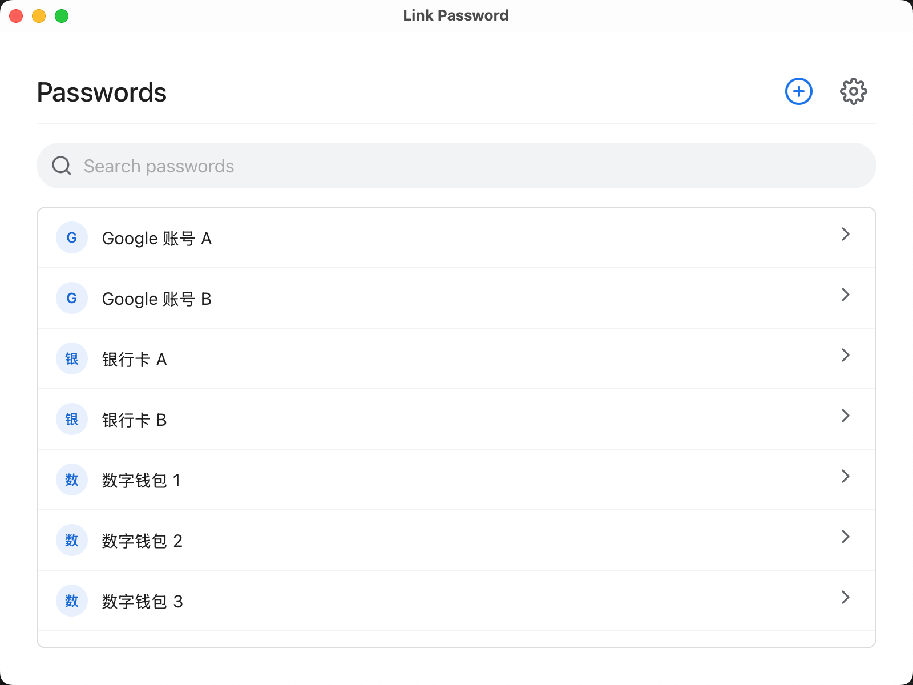

# Link Password

Link Password 是一款基于 **Tauri**、**React** 和 **TypeScript** 构建的安全、轻量级且现代化的密码管理器。它结合了 Rust 的高性能与安全性，以及现代 Web 前端的灵活性。



## 功能特性

- **💾 数据自主**：完全掌控您的数据。支持自定义存储路径，真正实现“我的数据我做主”。
- **🔒 安全存储**：采用 AES 加密保护您的所有密码。
- **⚡ 极速轻量**：由 Tauri (Rust) 驱动的原生级性能。
- **🎨 现代 UI**：简洁的界面，支持深色/浅色模式（跟随系统设置）。
- **👆 拖拽排序**：支持通过拖拽轻松调整账号排序。
- **🔍 快速搜索**：实时过滤，快速查找账号。
- **📋 一键复制**：安全快捷地复制解密后的密码。


## 技术栈

- **前端**: React, TypeScript, Vite
- **后端 / 核心**: Tauri (Rust)
- **状态 / 逻辑**: React Hooks
- **拖拽交互**: @dnd-kit

## 开发指南

### 环境要求

- [Node.js](https://nodejs.org/) & [pnpm](https://pnpm.io/)
- [Rust](https://www.rust-lang.org/tools/install)

### 安装与运行

1. 安装依赖：
   ```bash
   pnpm install
   ```

2. 启动开发模式：
   ```bash
   pnpm tauri dev
   ```

### 构建

构建生产环境版本：

```bash
pnpm tauri build
```

构建产物将位于 `src-tauri/target/release/bundle` 目录中。

## 使用指南

1. **添加账号**：点击 `+` 按钮，输入账号名称和密码。您可以选择设置主密码来加密该条目。
2. **解锁密码**：点击隐藏的密码，输入正确的主密码即可显示/复制。
3. **调整顺序**：在列拉列表中直接拖拽条目即可重新排序。
4. **设置**：点击齿轮图标，可修改数据存储路径或切换主题。

## 许可证

[CC BY-NC 4.0](LICENSE)
